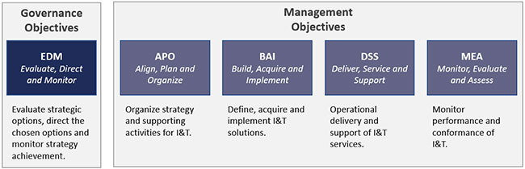

# Cobit 2019 Framework
## Wat is Cobit 19?
Cobit 19 is een Governance framework voor het inrichten van IT Goverance. Cobit is in tegenstelling tot ITIL meer gericht op beheersing van ICT en minder op de gedetailleerde inrichting van IT-processen.  

Cobit is meer gericht op het aansluiten van ICT en de bedrijfsdoelstellingen, wat moet er gebeuren. Cobit laat de inrichting over aan andere standaarden zoals ITIL om de hoe vraag de beantwoorden. 

Cobit voorziet de organisatie van een set meetinstrumenten, processen en best practices. Deze kunnen worden gebruikt om een IT-management model in te voeren binnen een organisatie. Dit model is gericht op risicobeheersing. 

Cobit 2019 bestaat uit 40 processen welke verspreid zijn over 5 domeinen, deze domeinen zijn als volgt:
1. Evaluate, Direct and Monitor 
2. Align, Plan and Organise
3. Build, Acquire and implement
4. Deliver, Service and Support
5. Monitor, Evaluate and Assess

[Klik hier voor een filmpje over Cobit 2019.](https://www.youtube.com/watch?v=v1Q-Zxf8rHQ)

## Hoe dit bijdraagt aan de governance van cloud processen, componenten, services, business en de mensen die ermee werken?
Cobit 2019 draagt bij aan de processen, componenten, services, business en de mensen die ermee werken door het geven van richtlijnen van de beheersing van ICT. Door richtlijnen te geven op basis van bedrijfsdoelstellingen kan dat bijdragen aan Cloud processen. Dat komt omdat deze richtlijnen op een betere en overzichtelijke manier kunnen worden ingericht. Dit heeft indirect ook invloed op de componenten en services die worden gebruikt binnen een business. Door het zetten van richtlijnen van bijvoorbeeld het gebruik van een bepaalde werk methode, krijg je dat er componenten en services worden gebruikt die gebruik maken van deze zelfde werk wijze. Deze invloed zal zich ook uitbreiden naar de mensen die met deze services moeten werken. Werknemers zullen zich gaan aanpassen aan deze werkwijze, waardoor de business hier ook de positieve gevolgen van gaat zien. Daarnaast is het voor het bedrijf heel makkelijk te controleren of ze de beheersing van ICT correct uitvoeren. De werkwijze is uniform en zorgt ervoor dat voor iedereen duidelijk is hoe het bedrijf werkt en waar het bedrijf aan toe is. 
 
Door deze richtlijnen op een rijtje te zetten kan je goed zien dat ze bijdrage leveren aan alle aspecten binnen een bedrijf.

## Worden alle aspecten die met Governance te maken hebben afgedekt?
Cobit 2019 dient als een Governance Framework om ICT en bedrijfsdoelstellingen te realiseren. Dit doet Cobit 2019 door het geven van standaarden voor bijvoorbeeld: meetinstrumenten, processen en best practices. 
 
Een aspect van Cloud Governance is het kijken of je het goede goed doet. En dit ook kunnen aantonen, door middel van werkwijze of inrichting. Dit sluit aan op de Cobit 2019 Governance Framework. Door richtlijnen te geven op bedrijfsdoelstellingen zorg je ervoor dat de doelstellingen op de juisten manieren worden gehaald. Hierdoor is het aspect het goede goed en dat aantonen afgedekt. Cobit 2019 geeft alleen geen richtlijnen op werkwijze. Hierdoor kan je met Cobit 2019 niet checken of je op de juiste manier werkt. Cobit 2019 geeft wel weer meer richtlijnen over risicobeheersing en beheersing van  
ICT. 
 
Verder heeft Cobit 2019 het Cloud Governance aspect responsibility afgedekt. Dit doet het doordat Cobit 2019 gaat over de bedrijfsdoelstellingen. Dit gaat dus ook over wie verantwoordelijk is over welk aspect binnen het bedrijf. Door deze richtlijnen goed te hebben afgedekt zorgt Cobit 2019 ervoor dat op een makkelijke en overzichtelijke manier de aansprakelijke persoon kan worden aangewezen. 
 
Cobit 2019 dekt dus veel aspecten af, maar kan niet zonder een andere Governance Framework. Voor namelijke Governance Frameworks als ITIL. 

## Wat zijn de sterke punten en wat is minder goed?
Een van de sterken punten van Cobit is dat het echt een aanvulling probeert te zijn en niet het zoveelste ITIL of ISO framework probeert te zijn. Het is meer gericht op (IT) managers en daardoor ook toegankelijker voor bedrijven om het te implementeren. 

Een klein nadeel van Cobit is dat het niet echt veel lijkt gebruikt te worden. Dit kan te maken hebben met het feit dat als men ITIL of een ISO standaard implementeert ook al bezig is met de beheersing van de ICT en Cobit dan niet zoveel toevoegt. Verder kan de naamsbekendheid hier ook een rol in spelen. Cobit is namelijk niet zo bekend binnen de IT-wereld.  

## Wat doen de grote public cloud providers eigenlijk met deze standaard/framework? Conformeren zij zich hieraan?
Op de website van Microsoft Azure, Amazon Web Services en Google Cloud Platform kan men geen documentatie vinden over Cobit 2019. Dit kom waarschijnlijk omdat Cobit 2019 meer gericht is op de beheersing van IT, in plaats van de implementatie hiervan. Hierdoor zijn er minder vraagstukken die een Cloud Provider vooraf zou kunnen invullen. 

ISACA biedt Audit Programs die wel kunnen helpen. Door middel van een assessment die men zelf uitvoert kunnen bedrijven controleren of ze alle control objectives goed geregeld hebben op de volgende gebieden:  

- Governance
- Network Configuration and Management
- Asset Configuration and Management
- Logical Access Control
- Data Encryption Controls
- Logging and Event Management
- Disaster Recovery
- Security Incident Response

Deze Audit Programs zijn beschikbaar voor [Amazon Web Services](https://store.isaca.org/s/store#/store/browse/detail/a2S4w000004KoGUEA0) en [Microsoft Azure](https://store.isaca.org/s/store#/store/browse/detail/a2S4w000004KoGTEA0). Voor Google Cloud Platform is er niet een specifiek audit program beschikbaar.

## Bronnen
1. https://pinkacademy.nl/wp-content/uploads/2021/03/COBIT-2019-Pink-Education.pdf
2. https://itmg.nl/training/informatie/best-practices/cobit-best-practice/
